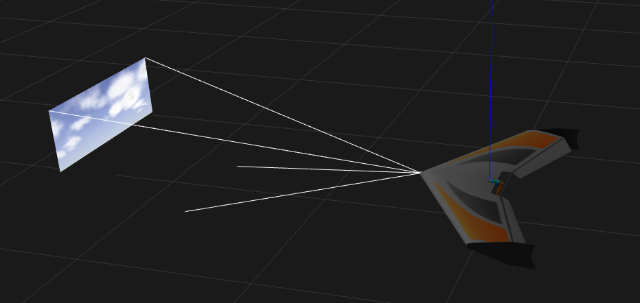

# ROS ve Gazebo Simulasyon

Bu repo, çeşitli drone senaryoları ve çeşitli drone konfigürasyonları için gazebo dünyalarına ev sahipliği yapıyor. Bu Repo, Ardupilot kontrol sistemi ile çalışmak üzere özel olarak tasarlanmıştır ve ardupilot kontrol yazılımının gazebo'da model drone ile arayüz oluşturmasına ve kontrol etmesine izin vermek için ardupilot gazebo eklentisini kullanır.

## Desteklenen Araçlar

- [Quadcopters](#drone-simulations)
- [Quad-Planes](#quad-planes)
- [Boats](#boat-simulation)
- [Plane](#plane-simulation)

## Bağımlılıklar 

İHA için yapay zeka repomdaki kurulum talimatlarını inceleyerek kendi işletim sisteminize ve istediğiniz araca uygun olan aşağıdaki paketleri kurmalısınız:
- [Ardupilot SITL Kurulumu](https://github.com/furkanisikay/iha-icin-yapayzeka-egitimi/blob/main/dokumanlar/ardupilot-sitl-kurulumu.md)
- [Gazebo Kurulumu \[***Ubuntu 18.04-20.04 için***\]](https://github.com/furkanisikay/iha-icin-yapayzeka-egitimi/blob/main/dokumanlar/gazebo-kurulumu.md)
- [Gazebo için Ardupilot Eklentisinin Kurulumu \[***Copter için***\]](https://github.com/furkanisikay/iha-icin-yapayzeka-egitimi/blob/main/dokumanlar/gazebo-icin-apm-eklentisi-kurulumu-copter.md)
- [Gazebo için Ardupilot Eklentisinin Kurulumu \[***Plane için***\]](https://github.com/furkanisikay/iha-icin-yapayzeka-egitimi/blob/main/dokumanlar/gazebo-icin-apm-eklentisi-kurulumu-plane.md)
- [ROS (Melodic) ve catkinws Kurulumu \[***Ubuntu 18.04 için***\]](https://github.com/furkanisikay/iha-icin-yapayzeka-egitimi/blob/main/dokumanlar/gazebo-icin-apm-eklentisi-kurulumu-plane.md)

# Kurulum
> Kuruluma geçmeden önce bağımlılıklar bölümü altındaki gerekli kurulumları yapıp ardından bu bölüme geçmelisiniz.
Öncelikle repoyu indirelim:

```console
cd ~/catkin_ws/src
git clone https://github.com/Intelligent-Quads/iq_sim.git
```
gazebo'ya modelleri nerede arayacağını söylemek için:
```console
echo "GAZEBO_MODEL_PATH=${GAZEBO_MODEL_PATH}:$HOME/catkin_ws/src/iq_sim/models" >> ~/.bashrc
```

## 5. Derlemek için
`catkin_ws` içinde, `catkin build`i çalıştırın:

```console
cd ~/catkin_ws && catkin build
```
bashrc'yi yenileyin:
```console
source ~/.bashrc
```

# Kullanım
## Drone Simulasyonu 


Bu depo, çeşitli ardupilot drone konfigürasyonları içeren birkaç farklı gazebo world dosyası içerir. Bu dünyalar aşağıda listelenmiştir:

- `droneOnly.world` - sadece bir drone içeren basit gazebo world 
- `runway.world` - sadece bir drone içeren basit asfaltlı bir gazebo world 
- `lidar.world` - 2d lidar sensörlü tek bir dron içeren basit bir gazebo world
- `multi_drone.world` - 12 dron içeren basit bir world

### **Drone Simulasyonu Çalıştırma**

Her world, karşılık gelen bir launch dosyası içerir. Örneğin, `runway.world` gazebo world dosyasını başlatmak için (1.Terminal):
```
roslaunch iq_sim runway.launch
``` 
Aşağıdaki kod ile Ardupilot SITL çalıştırın (2. Terminal):
```
cd ~/ardupilot/Tools/autotest/ && sim_vehicle.py -v ArduCopter -f gazebo-iris --console
``` 
## Quad Planes 

Quad Planes, hoverda quadcopter kontrollerini ve ileri uçuşta uçak kontrollerini kullanan bir vtol uçağıdır.


### Kurulum 

gazebo quadplane sim'i kullanmak için ardupilot'ta birkaç dosyanın değiştirilmesi gerekiyor, ilki aşağıdakini 274. satırdaki `ardupilot/Tools/autotest/pysim/vehicleinfo.py`dosyasına eklemek. bu Arduplane yapısı içinde olmalıdır.

```
"gazebo-quadplane": {
    "waf_target": "bin/arduplane",
    "default_params_filename": "default_params/gazebo_quadplane.parm",
},
```

copy the file `iq_sim/scripts/vtol-params/gazebo_quadplane.parm` to `ardupilot/Tools/autotest/default_params/gazebo_quadplane.parm`

### **VTOL simulasyon çalıştırma**

Birinci Terminal:
```
roslaunch iq_sim vtol.launch
```
İkinci Terminal:
```
sim_vehicle.py -v ArduPlane -f gazebo-quadplane  -m --mav10 --console -I0
```


## Tekne Simülasyonu

Recently I have been experimenting with Ardurover for controlling an autonomous boat. Below shows the steps for installing for boat simulation. If you have already installed for quadcopter simulation, then most of the boat installation should already be completed. 

[boat setup](docs/boat_setup.md)


## **Tekne Simülasyonu Çalıştırma**

Birinci Terminal:
```
roslaunch iq_sim boat.launch
```
İkinci Terminal:
```
sim_vehicle.py -v APMrover2 -f gazebo-rover  -m --mav10 --console -L Viridian
```

## Plane Simulasyonu 

- `plane_cam.world` - kameralı bir insansız hava aracı içeren basit gazebo dünyası (zephyr-wing modeli)

### **Plane Simulasyonu çalıştırma **


Ros ile beraber gazebo açmak için 1.Terminal:
```
roslaunch iq_sim plane_cam.launch
``` 
Ardupilot sitl açmak için 2. Terminal:
```
cd ~/ardupilot/Tools/autotest/ && sim_vehicle.py -v ArduPlane -f gazebo-zephyr  -m --mav10 --map --console -I0
``` 


## Gazebo modelleri


### drone1-12
This repo hosts a few helpful gazebo models you can use to build upon. Included in this repo are 12 drones which contain the ardupilot plugin. Each ardupilot plugin is staggered such that you can simulate multiple unique aircraft using ardupilot's SITL. For more information please see the iq_tutorial on [ardupilot drone swarming](https://github.com/Intelligent-Quads/iq_tutorials/blob/master/docs/swarming_ardupilot.md)

### drone_with_lidar

Example drone that has a 2d lidar attached. The lidar plugin publishes a `sensor_msgs/LaserScan` ROS msg containing return data.

topics
```
/spur/laser/scan
```


### drone_with_sonar

Example drone with 4 sonars attached in each direction. Each sonar publishes a `sensor_msgs/Range` ROS msg containing range data.

topics 
```
/drone1/sensor/sonar/back
/drone1/sensor/sonar/front
/drone1/sensor/sonar/left
/drone1/sensor/sonar/right
```


### drone_with_camera 

Example drone with a forward facing camera. The camera published a `sensor_msgs/Image` ROS msg which can be used to view or do image processing on. 


